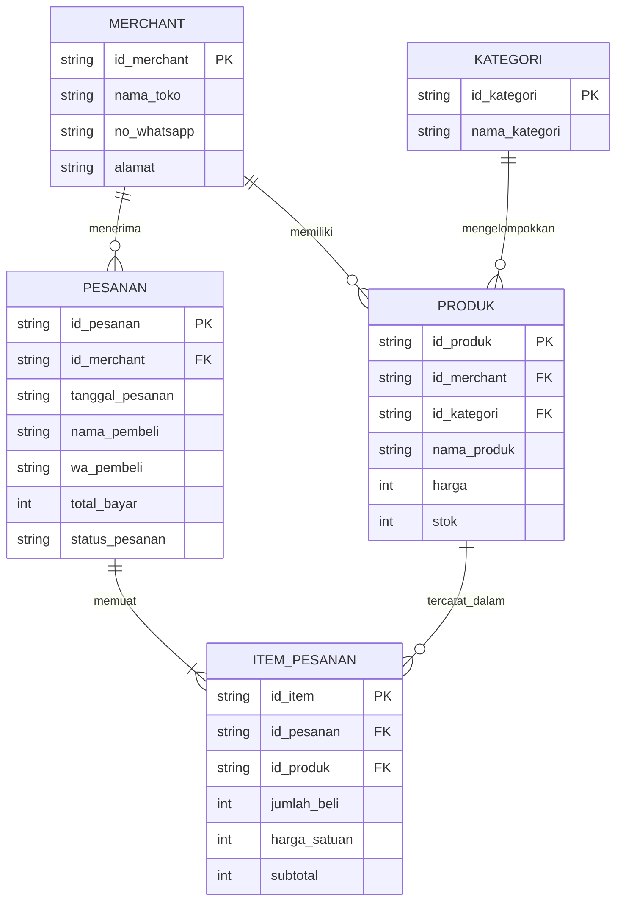

# Dokumentasi ERD Katalog UMKM (Bulan 1)

## 1. Diagram ERD (Mermaid)

```mermaid
erDiagram
    MERCHANT ||--o{ PRODUK : memiliki
    KATEGORI ||--o{ PRODUK : mengelompokkan
    MERCHANT ||--o{ PESANAN : menerima
    PESANAN ||--|{ ITEM_PESANAN : memuat
    PRODUK ||--o{ ITEM_PESANAN : tercatat_dalam

    MERCHANT {
        string id_merchant PK
        string nama_toko
        string no_whatsapp
        string alamat
    }

    KATEGORI {
        string id_kategori PK
        string nama_kategori
    }

    PRODUK {
        string id_produk PK
        string id_merchant FK
        string id_kategori FK
        string nama_produk
        int harga
        int stok
    }

    PESANAN {
        string id_pesanan PK
        string id_merchant FK
        string tanggal_pesanan
        string nama_pembeli
        string wa_pembeli
        int total_bayar
        string status_pesanan
    }

    ITEM_PESANAN {
        string id_item PK
        string id_pesanan FK
        string id_produk FK
        int jumlah_beli
        int harga_satuan
        int subtotal
    }
```
## 2. Simulasi Data Transaksi Nyata
## 3. Penjelasan Desain Skema